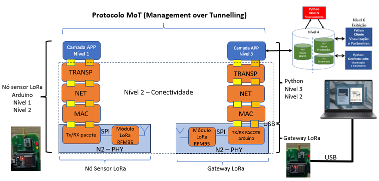
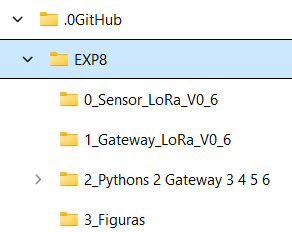
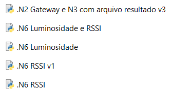

# DOCUMENTAÇÃO EXP8

## Introdução

O EXP8 é o exemplo mais simples de MAC centralizada e os códigos estão todos uniformizados.

---

## Revisão de Conceitos

A MAC centralizada cria uma política de acesso ao meio em que o Nível 3 - Borda envia um pacote de DL para o nó sensor, que responde com um pacote de UL.

A próxima figura mostra uma topologia estrela.

**Figura 1 - Topologia Estrela**

### Sites com explicações sobre topologia de rede

- https://www.ibm.com/br-pt/think/topics/network-topology
- https://blogtecnologista.com/topologias-de-rede-estrela-arvore-barramento-anel-e-malha-explicacoes-praticas-para-o-dia-a-dia/

---

# Framework TpM

**Figura 2 - Framework**

---

## Organização dos códigos

Organizar os códigos em subdiretórios numerados para facilitar a documentação do framework.

**Figura 3 – Estrutura de diretórios**

---

## Código do Nó Sensor

Explicações do código do nó sensor.

---

## Código do Gateway

Explicações do código do gateway.

---

## Pythons

**Figura 4 – Arquivos do Python**

.