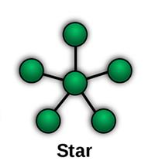

# EXP8

## Introdução
O EXP8 é o exemplo mais simples de MAC centralizada e os códigos estão todos uniformizados.

## Revisão de Conceitos
A MAC centralizada cria uma política de acesso ao meio em que o Nível 3 - Borda envia um pacote de DL para o nó sensor, que responde com um pacote de UL

## Organização dos códigos

